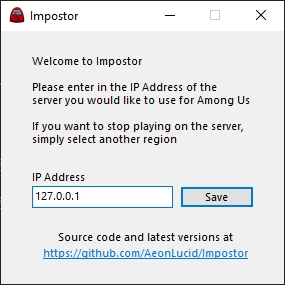

# Impostor

Impostor is one of the first **Among Us** private servers, written in C#. 

| Impostor version | Among Us version | Experimental | Download |
|-|-|-|-|
| 1.1.0 | 2020.09.07 - 2020.09.22 | No |  |
| 1.2.2 | 2020.09.22 - 2020.11.17 | No |  |
| 1.3.0 | 2021.3.5 | No |  |
| 1.4.0 | 2021.3.31 - 2021.4.2 | Yes |  |

## Features

- All Among Us features are implemented. It is a full replacement for the official server.
- Plugin support.
- Server-sided anticheat.

## Installation

### Client

If you just want to play on a server hosted by someone else, you need to follow these instructions.

#### Windows

1. Find the [latest release](https://github.com/AeonLucid/Impostor/releases/latest).
2. Download `Impostor-Patcher-win-x64.zip`.
3. Extract the zip.
4. Run `Impostor.Patcher.exe`.
5. Follow the instructions inside the application.

If you do not wish to execute any programs. Follow the instructions in [this website](https://impostor.github.io/Impostor)

#### Android

##### Android 10 and below.
1. Go to [this website](https://impostor.github.io/Impostor) **(ON YOUR MOBILE DEVICE)**
2. Follow the instructions listed there.

##### Android 11.
1. Connect your phone to a computer. Go to [this website](https://impostor.github.io/Impostor) on the computer and follow the steps 1 and 2 to generate a `regionInfo.dat` file.
2. Instead of following the next steps, open the phone's internal storage on your computer and navigate to `/sdcard/Android/data/com.innersloth.spacemafia/files`.
3. Copy the generated `regionInfo.dat` file into the `files` folder you just navigated to.

#### iOS

iOS devices need to be jailbroken in order to connect to Impostor servers. 

### Server

See the [docs](docs/Running-the-server.md) for instructions on how to set it up.

## Troubleshooting

See [TROUBLESHOOTING](docs/TROUBLESHOOTING.md) to solve issues the Impostor client or the server.

## Contributing

See [CONTRIBUTING](CONTRIBUTING.md).

## License

This software is distributed under the **GNU GPLv3** License.

## Credits

- [willardf/Hazel-Networking](https://github.com/willardf/Hazel-Networking)
